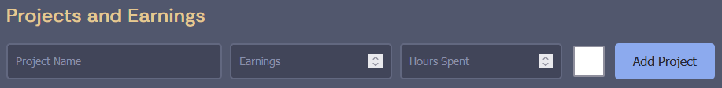
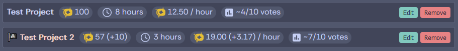

# [Doubloon-Finance](https://shymike.is-a.dev/doubloon-finance/)
 Website to keep track your HackClub HighSeas projects and earnings.
 
# Features
- Tracking hours spent, doubloons earned and doubloons per hour per project
- Tracking total spent time, total doubloons earned and average doublouns per hour
- Tracking blessed/not blessed projects
- Full shop replica for easy selection of a goal prize
- Projecting time needed for a prize
- Calculating doubloons needed for a prize and if you can buy it (and how many times)
- Editing/deleting existing tracked projects

## Usage

### Input field:

1. Project name
2. Doubloons earned
3. Hours spent
4. Was the project blessed?

### Project list:

1. Project name (flag and color means its blessed)
2. Doubloons earned
3. Hours spent
4. Doubloons per hour
5. Average votes received

(values in brackets show much the blessing changed the original values)

## Average votes calculation
The calculation that is used for determining the average votes for each project is an approximation made by me that uses the following formula: `average_votes = (doubloons_per_hour - 4.8) / 1.92`.
It assumes the minimum hourly doubloons value is `4.8` and the maximum is `24` (values obtained from the `minimumHoursEstimated`, `maximumHoursEstimated` and `priceGlobal`/`priceUs` values from `shop.json`) and that the function is linear (its just a guess that is most likely wrong).
Using the formula, the table for each vote number is:

| Votes | Range                   |
|-------|-------------------------|
| 0     | 4.80 &nbsp; **~** 5.76  |
| 1     | 5.76 &nbsp; **~** 7.68  |
| 2     | 7.68 &nbsp; **~** 9.60  |
| 3     | 9.60 &nbsp; **~** 11.52 |
| 4     | 11.52 **~** 13.44       |
| 5     | 13.44 **~** 15.36       |
| 6     | 15.36 **~** 17.28       |
| 7     | 17.28 **~** 19.2        |
| 8     | 19.2 &nbsp; **~** 21.12 |
| 9     | 21.12 **~** 23.04       |
| 10    | 23.04 **~** 24          |
 
## Notice
The doubloons, hours, votes and prize images are directly from [HighSeas](https://highseas.hackclub.com/), which has it's own [repository](https://github.com/hackclub/high-seas).

## License
This project is licensed under the [MIT License](LICENSE).
